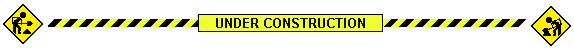

welcome to my site! please excuse the construction

check out my most recent posts:

<ul>
  
  <li>
     - <a href="{{ post.url }}">{{ post.data.title }}</a>
  </li>
  
</ul>

or see:

- [all the posts i've made][archive]
- [ways to contact me][contact]
- [what i should be doing][todo]
- [licenses and other legal stuff][legal]

[]{.wide .center}

{.center}

[archive]: /archive.html
[legal]: /legal.html
[todo]: /todo.html
[contact]: /contact.html
